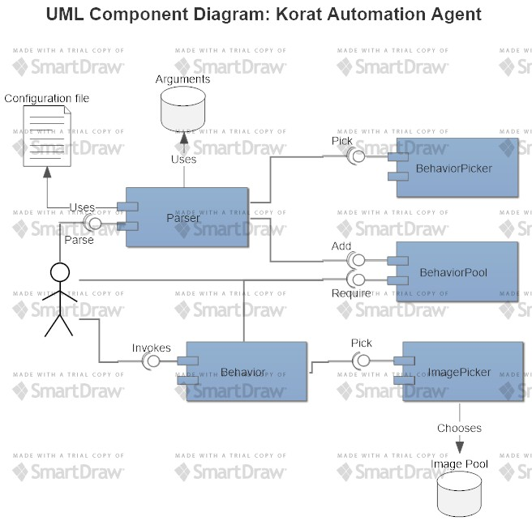

# Korat-Framework
For designing the Korat framework.

## Analysis
The potential changes in every Korat automation project are listed bellow:

### Possible changes
- Images
- Behaviors

### When Do Image Change?
- Target application patched to next version
  - Win 95 -> 98 -> 2000 -> XP -> 7 -> 8 -> 10
- Target application migrated to another "host"
  - Browse certain web App on *IE 7 v.s. IE 8* v.s. Chrome v.s. Firefox v.s. Safari
  - Operate Chrome on Windows 7 v.s. Ubuntu 14.04 v.s. Mac OS
- Conclusion: Possibility of image change depends on App version update and host change (including distrubution and version change)

### When Do Behavior Change?
- Target application patched to next version
  - For example: Search installed program by keyword:
    - Windows 7: `Win` -> type `keyword`
    - Windows 8: `Win` -> click :mag: -> type `keyword`
- Distrubution of target application changed
  - For example: Perform "copy - paste" task:
    - Ubuntu 14.1: `Ctrl + Shift + C`
    - Windows 10: `Ctrl + C`

## Goals
Behaviors and images can be easily replaced without modifying any line of code.

## Arthitecture Design
Core concept: Determine which behaviors and images to be used by the data read from configuration file, or from the arguments passed to exe.



## Demonstration
About how to easily replace behaviors and images, please look at [App/Program.cs](App/Program.cs):
```csharp
class Program
{
    static void Main(string[] args)
    {
        Korat korat = new Korat();

        // Constructs behavior pool by "BehaviorPool pool = Parser.Parse(args)" in the future.
        BehaviorPool pool = new BehaviorPool();
        pool.Add(new WinBehaviorsPicker(korat, pool).Pick("7"));
        pool.Add(new ChromeBehaviorsPicker(korat, pool).Pick("60.0"));

        ChromeBehaviors chrome = pool.Request<ChromeBehaviors>();
        OsBehaviors os = pool.Request<OsBehaviors>();

        if (chrome == null || os == null)
        {
            Console.WriteLine("No such behaviors.");
        }
        else
        {
            os.OpenApp("chrome");
            chrome.GetUrlText();
        }

        Console.Read();
    }
}
```

The console output should be:
```
Korat sends keys: Control, R
Korat sends string: "chrome".
Korat sends key: Return.
Korat sends key: F6.
Korat sends keys: Control, C
```
